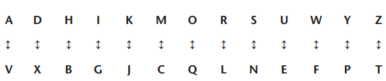

# Chapter 1

# Introduction

Imagine you and me gossiping about a person and suddenly that person enters the spot, I started talking with you in our regional language which the other person doesn’t know. It’s a great escape! This is how code language helps you hide information. The Code Book by Simon Singh aims to cover 2 main objectives: Evolution of codes and Relevancy of codes today.

Mary Queen of scots developed code in her letters to conspirators where the plan of assassination against Queen Elizabeth had been encoded. But Sir Francis Walsingham who was secretary of Queen Elizabeth had company of an expert codebreaker Thomas Phelippes who later broke the plot set against Elizabeth. The Chapter 1 introduces various secret writing examples from history and methods of breaking the code. 

# Secret writings

The earliest version of cipher text was inscribed in a folding wooden tablet covered with the wax, which can be scrapped off to see what’s written within it. This method was used by Demaratus who wanted to protect his homeland Greece from Persian invasion headed by Xerxes. The Persian military phalanx planned for 5 years was shattered after their concoction of rebellion was leaked by the small wooden tablet. Greece resisted the war.  

Another humorous way to safely passage message was to writing on the scalp by shaving the messenger’s head, wait for the hair to grow. When messenger reaches out the recipient, again he shaves the hair to reveal the message.

Chinese write messages on fine silk, scrunch it to a ball covering by wax which will be swallowed by the messenger. The interesting part about messages written using invisible ink from tithymalus plant milk when exposed to fire, it turns brown. It is because of high carbon content which chars the ink.

All these methods collectively are called steganography, which literally means to write by covering the message in a medium. If we observe closely, the messages are subjected to be revealed at a particular point of time. Here comes Cryptography for rescue. In cryptography we hide the message by process called encryption.

### Steganography vs cryptography

When the message is as it is covered by some material is steganography and in cryptography the scrambled message is transported to recipient which will be unscrambled by a logic shared between sender and recipient only. 

Cryptography can be done using two methods - Transposition and Substitution. 

#### Transposition

In transposition the characters are rearranged to form anagram. For example, 

<aside>
🐶

dog : odg god dgo gdo etc,..

</aside>

For a single word the possible combinations can be minimal and can be easily decoded. But for one long sentence there can be 50,000,000,000,000,000,000,000,000,000,000 combinations. It is impossible to decode even if multiple person tries every second. 

The disadvantage of transposition is  

#### Substitution

In substitution we randomly pair alphabets and replace the letter with its pair. Substitution is described in *Kama-sutra* as *mlecchita-vikalpa.* Julius Caesar’s Gallic Wars does the first use of substituion by replacing roman letters with greek letters*.*  In English, we can randomly pair letters like (A,V), (D, X),…

For example,

<aside>
👋🏻

“hello” can be encrypted as “burrq”

</aside>

In summary, transposition changes the position of text and substitution the position is retained.

# The Caesar Cipher

Caesar Cipher which is named after Julius Caesar for the earliest application of Substitution Cipher is the effective way of communication and secure as well. 

Here, the each letter of plain text or the message is substituted by a letter that is shifted 3 steps from the letter. For the letter ‘A’, letter ‘D’ is 3 steps ahead and ‘A’ is substituted by ‘D’.

# Algorithm and key

The message is modified by encryption using an algorithm and a key to formulate it. The sender sends the message by encrypting using some logic known as algorithm and the key has the details about how it is formulated. For example, encrypting using Caesar Cipher and shifting 5 steps is the key.

The best to formulate a key is by using keyphrase or keyword. For example, if we have a keyword CODERS we remove the repeated letters and substitute it to the first part of series. The later part will be continued by the rest of the letters as shown below

| Plain text | A | B | C | D | E | F | G | H | I | J | K | L | M | N | O | P | Q | R | S | T | U | V | W | X | Y | Z |
| --- | --- | --- | --- | --- | --- | --- | --- | --- | --- | --- | --- | --- | --- | --- | --- | --- | --- | --- | --- | --- | --- | --- | --- | --- | --- | --- |
| Key | C | O  | D | E  | R  | S | T | U | V | W | X | Y | Z | A | B | C | D | E | F | G | H | I | J | K | L | M |

<aside>
🔑

H E L L O is encrypted as U R Y Y B

</aside>

The advantage of this kind of encryption is that it can’t be intercepted by the enemy unless they crack the key.

# The Arab and the cryptography

The revelations of Islam were made by Muhammadan, Abu Bakr and followed by many prophets.

The theologists were interested in chronology of revelations for which they counted the frequency of words in them.

Adab al-Kutt¯ab (The Secretaries’ Manual) says the letter ‘a’ and ‘l’ are the most frequent letters in Arab. Because ‘al’ is the most frequently occured word in arabian language. This way of analyzing the frequency of occurence of words and their frequency is called the frequency analysis which is mentioned in Al-Kindı¯’s  Manuscript on Deciphering Cryptographic Messages. 

In English, ‘e’ is the most common letter, followed by t, then a. By this information we can encounter a cipher text by analyzing the frequency, such that if some letter like ‘f’ is the most frequent then it’s most probably going to be ‘e’. The process goes like :

1. Find the frequently occurring letters and mark them as ‘first frequent’, ‘second frequent’… in the plain text
2. Similarly find the frequent letters in cipher text
3. Examine the position and neighbours, check if every occurance is vowel…

The monoalphabetic substitution cipher where the letters are replaced by symbols can also be cracked using frequecy analysis. It is helpful when there’s no idea or clue of key.

## Encoding vs Encrypting

Encode the message means to replace the words with certain symbols but encryption is to substitute the letters. 

# The Climax

Gifford, the double agent who masked his catholic background to act as mediator between Mary and conspirators ant the same time helped Walsingham by handing over the letters to him. As Walsingham had employed Thomas Phelippes, the Codebreaker use frequecny analysis to crack the codes. Everytime when he encounters some frequency, he notes them down. Repaets the process until he finally cracks the code. The process revveals that Queen Mary set plot aginst Elizabeth and hence she was put to death in public.

# Conclusion

Encryption methods like substituition helps transport codes securly. Codes are necessary for today’s digital world, but it is understandable that methods like frequency analysis help them break as well. With the help of suchh methods the codes can be broke effectively by agents like Thomas Phelippes.